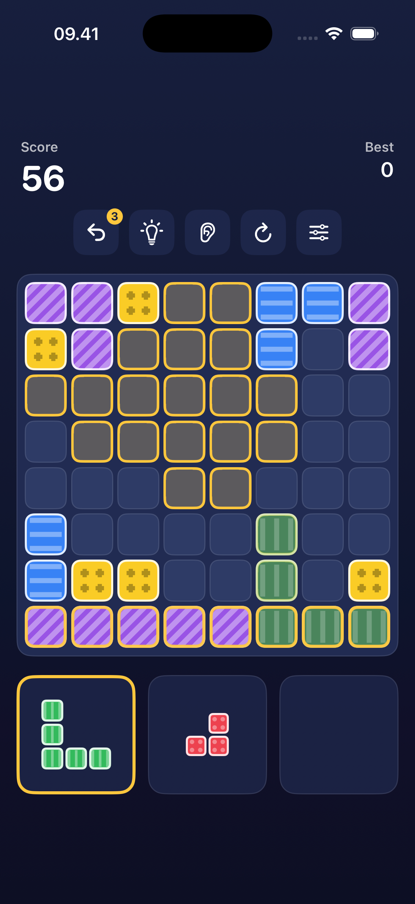

# Block Blast — Accessible Edition

A block-puzzle game for iPhone and iPad where accessibility is the design, not a settings page.
Every piece of information the game gives you exists on three channels at once — **visual, audio and
haptic** — so losing any one of them still leaves the board fully readable and fully playable.



*Sticky-drag mode. A piece is picked up from the tray, and every legal landing spot is marked with a
dashed outline and a pip — never a fill, because a filled cell always means an occupied cell.*

---

## The idea

Block Blast is a great puzzle game that is almost unplayable without sight, and hard to read with
colour-vision deficiency. This is a rebuild of the mechanic — 8×8 grid, three pieces at a time,
clear full rows and columns — where the accessibility work goes all the way down into the model:

- **Colour is never the only signal.** All seven block colours carry a distinct pattern, a distinct
  spoken name and a distinct audio timbre. The `Minimal` theme paints every block the same white,
  which is a built-in proof that the game never leans on hue.
- **The board can be heard.** Each cell has a pitch (row) and a position in space (column), rendered
  through an HRTF audio environment. A player can scan the board by ear and build a mental map.
- **Nothing requires dragging.** Drag, tap-tap and dwell all drive the same state machine, and you
  can switch between them mid-run.
- **Mistakes are cheap.** Undo is earned continuously, near-misses snap to a legal spot, and Zen mode
  has no game over at all.

## Requirements

| | |
|---|---|
| Xcode | 26.6 or later |
| Deployment target | iOS 26.5 |
| Devices | iPhone and iPad (portrait, landscape, Split View) |
| Dependencies | None — no packages, no audio assets |

Open `BlockBlast.xcodeproj`, pick a simulator or device, and run.

## Gameplay

Three pieces at a time, drawn from a weighted bag of 30 silhouettes. Place them anywhere they fit;
completing a row or a column clears it.

- **Scoring** — one point per cell placed, plus `lines² × 10` for a clear, multiplied by the combo.
- **Combo** — grows with every consecutive placement that clears at least one line, capped at ×5.
- **Undo** — one token to start, one more earned every three pieces, banking up to three.
- **Hints** — an optional button that finds a legal move, prefers one that clears lines, then
  announces and highlights it.
- **Zen mode** — no game over. When nothing fits, the fullest rows dissolve and play continues.

## Accessibility

### Blind and low vision

Every cell and every tray slot is a labelled VoiceOver element:

> "Row 3, column 5, red with dots, fits here, clears 2 lines"

Piece descriptions lead with size, because size is what decides whether a piece still fits:
*"3 by 2 T-shape, 5 cells, blue with horizontal stripes."*

**Sonic navigation.** Every sound is synthesised at runtime rather than shipped as an asset, so the
pitch mapping used for navigation stays exact and every cue can be re-voiced per sound pack. Row maps
to pitch on a C-major pentatonic scale — no interval in it sounds "wrong", so scanning never produces
a false alarm — and column maps to position through an `AVAudioEnvironmentNode`.

| Event | Sound |
|---|---|
| Piece placed | ascending major triad, C–E–G |
| Line cleared | sparkling arpeggio, one octave higher per extra line |
| Combo | harmonic stacking — the chord literally gains a partial per combo step |
| Invalid move | low sawtooth buzz |
| Game over | descending scale into a low glide |

**Audio explore.** The ear button turns the board into a direct-touch surface: drag a finger to hear
each cell as you cross it, lift to hear it described, triple-tap to place the piece in hand. This is
the mode for playing with VoiceOver and Screen Curtain on.

**Haptics.** Core Haptics mirrors every cue — a looping heartbeat while a piece is in hand, a sharp
tick when it crosses a cell where it fits, a dull thud where it does not, and a burst that grows with
the number of lines cleared. Falls back to UIKit feedback generators on hardware without Core Haptics.

### Colour blind

Each colour owns a pattern that is always drawn: dots, horizontal stripes, vertical stripes,
crosshatch, diagonals, checkerboard, waves. Pattern ink is chosen per block for contrast, and block
borders thicken automatically under Increase Contrast.

Deuteranopia, protanopia, tritanopia and achromatopsia simulation can be switched on for the **whole
game**, not just a preview swatch — so you can verify a palette in the situation you actually play in.
Settings also carries a block key listing every colour with its pattern name.

### Motor and cognitive

| Mode | How it works |
|---|---|
| **Drag & drop** | Direct manipulation. The piece floats above your finger, and a near-miss snaps to a neighbouring legal spot. |
| **Sticky drag** | Tap a piece, legal spots light up, tap one. No dragging at all. |
| **Dwell control** | Tap a piece, then rest on a cell — a ring fills and it places itself. Works with Switch Control. Dwell time is adjustable from 0.4 to 4 seconds. |

Plus optional confirm-before-placing (the first tap only aims), Reduce Motion support throughout, and
a one-tap **maximum accessibility preset** that configures high contrast, patterns, tap-to-place,
spatial audio, haptics and verbose speech together.

## Customisation

- **Themes** — Classic, Neon Glow, Pastel Soft, High Contrast, Nature, Minimal
- **Sound packs** — Synthetic (clearest pitch cues), Organic, Retro, Nature
- **Clear effects** — Shatter, Dissolve, Slide out, Implode
- **Speech** — concise / standard / verbose, with score announcements on or off

## Localisation

English and Indonesian, in one string catalog covering UI text, VoiceOver labels and spoken feedback.
Numbers follow the locale (`1,250` / `1.250`). Language follows the system setting, and Settings links
straight to the iOS per-app language screen.

Siri shortcuts work in both languages: *"Start Block Blast"*, *"Mulai Block Blast"*, *"Mulai mode Zen
di Block Blast"*.

## Project structure

```
BlockBlast/
├── Models/          GridPosition, BlockColor, Piece, Board — pure value types, no UI
├── Game/            GameEngine (rules, scoring, undo), GameSettings, FeedbackCoordinator
├── Audio/           Runtime tone synthesis, earcon vocabulary, spatial audio graph
├── Haptics/         Core Haptics patterns with UIKit fallbacks
├── Accessibility/   VoiceOver announcements and every spoken phrase
├── Theme/           Six palettes, contrast boosting
├── Views/           SwiftUI board, tray, settings, game over, effects
└── Intents/         App Intents for Siri and Shortcuts
```

The rules live entirely in `Board` and `GameEngine` and never touch UI, audio or haptics — which is
what makes undo a value copy and the board testable on its own. The engine emits a `GameEvent`, and
`FeedbackCoordinator` renders that one event into sound, touch and speech, so the three channels
cannot drift out of sync.

## Status

The engine is verified by a headless self-play harness: board rules, simultaneous row-and-column
clears, scoring, undo restore, undo-token accrual, a classic run played to game over, and a 400-move
Zen run that never dead-ends. Audio buffers are checked audible and non-clipping for all four packs.

Still to verify on physical hardware: haptics, HRTF spatial audio, and a full VoiceOver plus Screen
Curtain pass — none of which the simulator can exercise honestly.
